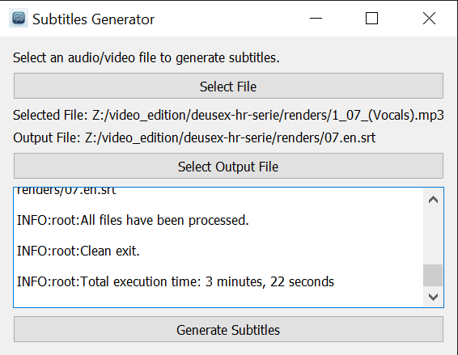

# Subtitles Generator

Subtitles Generator is a versatile tool designed to generate subtitles (SRT files) from audio files (MP3 format) or video files. It leverages advanced processing to interpret audio content and create time-stamped subtitles suitable for various applications. This tool is built on the **[`whisper_timestamped`](https://github.com/linto-ai/whisper-timestamped)** package and now includes a user-friendly graphical user interface (GUI) for easier operation.

## Features

- Support for input in MP3 audio format and video format.
- Customizable checkpoints for subtitle segments.
- Ability to specify specific audio segments for processing.
- Language specification for the audio content.
- Control over the output file path and naming.
- Graphical User Interface (GUI) for simplified operation.

## Requirements

- Python 3.x

## Installation

- This application relies on **[`whisper_timestamped`](https://github.com/linto-ai/whisper-timestamped)** (among other packages) for proper functionality. Refer to its [installation](https://github.com/linto-ai/whisper-timestamped#installation) instructions for enabling it into the system.

- Clone this repository or download the source code. Install the other required packages by running either `install_dependencies.cmd` or `install_dependencies.sh`.

## Usage

The application can be used in two ways: through the command line or via the graphical user interface (GUI).

### Using the GUI

For a more user-friendly experience, especially for those not comfortable with command-line operations, the Subtitles Generator includes a GUI. To open the GUI, run:

```
python gui.py
```

In the GUI, you can easily set the input file and the output path. Once all parameters are set, simply click the 'Generate' button to start the subtitle creation process. All the other arguments used in the CLI option will be translated into proper GUI controls in the future.



### Using the Command Line

The application can also be initiated with specific parameters detailed below:

#### Mandatory Arguments:

- `-i` or `--input`: The path to the input audio file in MP3 format or video format. This argument is required.
  - If audio is provided, then the final result will be more accurate if the input audio is clean and contains only voices. For cleaning audio before passing it to the tool, use software like **[UVR](https://github.com/Anjok07/ultimatevocalremovergui)**. As a future feature this audio cleaning will be integrated automatically into this tool. For now is WIP in the following branches:
    - [Enhacement of input speech using SpeechBrain](https://github.com/hrkns/subtitle-generator/tree/v0.1.x-speech-enhacement-using-speechbrain).

#### Optional Arguments:

- `-o` or `--output`: The path where the SRT file will be saved. If only a directory path is provided, the application will save the output with a default name. If not provided at all, then the output location will be the same one as the input.

- `-c` or `--checkpoints`: Specific times (checkpoints) for subtitle segmentation, provided in a comma-separated list in the format `hh:mm:ss` or a single value in format `{number}{s|m|h}` (for example, `5h` for expressing checkpoints every five hours). Hours and minutes are optional in the `hh:mm:ss` format. Checkpoints usage increase the accuracy of the final result. This is something related to how [`whisper_timestamped`](https://github.com/linto-ai/whisper-timestamped) package works and we hope to solve it in the future so this input is no longer required.

- `-s` or `--segments`: Specific segments of the audio file to process, provided in the format start-end (e.g., 00:50-13:57) or a single value in format `{number}{s|m|h}` (for example, `5h` for expressing segments of five hours each). Segments are used for re-generate subtitles for the specified intervals and these results can either be put in a new SRT file or merged into an existing one with the merge flag (`-m` or `--merge`).

- `-m` or `--merge`: Merge the output of the process into an existing SRT file either indicated with the output input flag or implicitly inferred from the input path.

- `-l` or `--language`: The language of the audio content. This information will be used for speech recognition purposes. Supported languages and how the Whisper AI models perform for each one can be found [here](https://github.com/openai/whisper#available-models-and-languages). If no value provided, then the default one will be `en` (English).

### Examples:

1. Basic usage with mandatory parameters:

```
python main.py -i /path/to/audio.mp3
```

2. Indicating output explicitly:

```
python main.py -i /path/to/audio.mp3 -o /path/to/output.srt
```

3. Including checkpoints in `hh:mm:ss` format:

```
python main.py -i /path/to/audio.mp3 -c 00:30,05:00,10:00
```

4. Including checkpoints in periodic format (every five minutes):

```
python main.py -i /path/to/audio.mp3 -c 5m
```

5. Specifying segments:

```
python main.py -i /path/to/audio.mp3 -s 00:50-13:57
```

6. Specifying segments with periodic format (segments of five minutes each):

```
python main.py -i /path/to/audio.mp3 -s 5m
```

7. Setting the language:

```
python main.py -i /path/to/audio.mp3 -l en
```

## Contributing

Contributions, issues, and feature requests are welcome!

## License

[AGPL](https://www.gnu.org/licenses/agpl-3.0.en.html)

## TODO

- Automatically clean input audio before applying speech detection.
- Add features to GUI for manipulating and customizing the output of the process.
- Allow other audio formats as input.
- Enable translation of generated subtitles to other languages.
- Be able to specify in the input arguments the model to be used by whisper for speech to text process.
- Create EXE file to be distributed.
