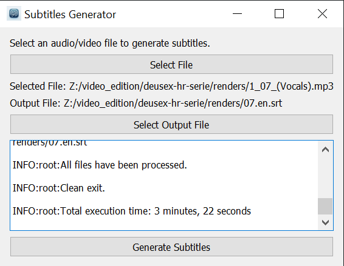

# Subtitles Generator

Subtitles Generator is a versatile tool designed to generate subtitles (SRT files) from audio files or video files. It leverages advanced processing to interpret audio content and create time-stamped subtitles suitable for various applications. This tool is built on the **[`whisper_timestamped`](https://github.com/linto-ai/whisper-timestamped)** package and now includes a user-friendly graphical user interface (GUI) for easier operation.

## Features

- Support for guaranteed input in MP3 and WAV audio files, plus MP4 and AVI video files.
- Optional audio preprocessing modes in both the CLI and GUI: `off`, `basic`, and `speechbrain`.
- Customizable checkpoints for subtitle segments.
- Ability to specify specific audio segments for processing.
- Language specification for the audio content.
- Control over the output file path and naming.
- Graphical User Interface (GUI) for simplified operation.

## Requirements

- Python 3.13.1 or higher

## Installation

- This application relies on **[`whisper_timestamped`](https://github.com/linto-ai/whisper-timestamped)** for transcription and still depends on its external system prerequisites where applicable. Refer to its [installation](https://github.com/linto-ai/whisper-timestamped#installation) instructions if you need help with system-level setup such as FFmpeg.

- Clone this repository or download the source code. Install the default runtime dependencies by running either `install_dependencies.cmd` or `install_dependencies.sh`.
  - This base install now covers the core transcription stack plus the default `off` and `basic` cleaning modes.

- To enable the optional `speechbrain` cleaning mode, install the heavier enhancement stack by running either `install_speechbrain_dependencies.cmd` or `install_speechbrain_dependencies.sh`.
  - This optional install adds the SpeechBrain inference backend used by `--cleaning-mode speechbrain`.
  - The application detects when this optional backend is missing and reports that `speechbrain` is unavailable instead of falling back silently or failing ambiguously.
  - Downloaded model assets are cached under `audio_cache/` and are not required when using `off` or `basic`.

- For local development and test execution, install the additional dependencies by running `install_dev_dependencies.cmd` or `install_dev_dependencies.sh`.

## Audio Cleaning Status

Automatic audio cleaning is now wired into the CLI preprocessing stage that runs between working-audio normalization and transcription.

The current CLI-supported modes are:

- `off`: use the normalized working WAV without additional cleaning
- `basic`: apply a lightweight Pydub-based cleanup chain
- `speechbrain`: apply SpeechBrain enhancement when its optional dependencies are available
  - This is the heavier optional backend and it requires the optional SpeechBrain install step.
  - If its dependency stack or model assets are unavailable, the application fails explicitly for that run and does not silently fall back.

The CLI can also persist a chosen cleaning mode as the new default for future runs.
If `--cleaning-mode` is omitted, the CLI resolves the effective mode in this order:

- explicit per-run `--cleaning-mode`
- saved default cleaning mode from `./.app-config.json`
- built-in default `off`

An explicit cleaning mode always wins for the current run, even when a saved preference already exists. The saved preference is only reused when no per-run mode is provided.

The GUI now exposes the same cleaning-mode selection and save-default control as the CLI.
When `speechbrain` is selected, the GUI validates both dependency availability and model readiness before execution starts, so first-run model download failures are surfaced before the subprocess begins.
GUI-specific state is now stored in a dedicated local app config file at `./.app-config.json`, which keeps the last used paths, preferred cleaning mode, auto-apply preference, and strategy-specific settings together in one place.

The current implementation target for this branch is documented in [Audio Cleaning Behavior Contract](docs/audio-cleaning-behavior-contract.md). It defines the planned cleaning modes (`off`, `basic`, and `speechbrain`), the precedence between per-run choice and saved defaults, and the rule that unavailable cleaning backends must fail explicitly instead of silently falling back.

## Supported Input Formats

The project currently documents and guarantees support for these input file types:

- Audio: `.mp3`, `.wav`
- Video: `.mp4`, `.avi`

The GUI file picker currently exposes exactly those four extensions.

The backend is slightly more permissive than the GUI filter, but only on a best-effort basis:

- Audio input in the CLI is decoded through Pydub (`AudioSegment.from_file`). Additional audio formats may work if the local decoder stack available to Pydub, typically FFmpeg or Libav, can open the file and its codec.
- Video input is identified through `python-magic` using the file MIME type (`video/*`) and then processed through MoviePy for audio extraction. Additional video formats may work if their container and codec are supported by the local MoviePy and FFmpeg setup.

Those additional formats are not currently part of the documented support contract, because behavior depends on which codecs and media backends are installed on the machine running the tool.

All accepted input is normalized into an internal WAV working file before segmentation and transcription.

## Usage

The application can be used in two ways: through the command line or via the graphical user interface (GUI).

### Using the GUI

For a more user-friendly experience, especially for those not comfortable with command-line operations, the Subtitles Generator includes a GUI. To open the GUI, run:

```
python gui.py
```

In the GUI, you can easily set the input file and the output path. Once all parameters are set, simply click the 'Generate' button to start the subtitle creation process. All the other arguments used in the CLI option will be translated into proper GUI controls in the future.

The GUI now includes:

- a cleaning-mode selector with `off`, `basic`, and `speechbrain`
- an auto-apply checkbox that controls whether the preferred cleaning mode is preselected on startup
- a checkbox to save the selected mode as the default for future runs
- a status message that explains the selected mode and warns when `speechbrain` is unavailable
- a pre-launch validation step for `speechbrain` that checks the real enhancer can be prepared before the generation subprocess starts



### Using the Command Line

The application can also be initiated with specific parameters detailed below:

#### Mandatory Arguments:

- `-i` or `--input`: The path to the input audio file in a supported audio format or supported video format. This argument is required.
  - The input is normalized into an internal WAV working file before segmentation and transcription.
  - You can leave cleaning disabled with `off`, use the default lightweight `basic` mode after the base install, or enable the optional heavier `speechbrain` mode after running the separate SpeechBrain installer.
  - Guaranteed supported input extensions are listed in the [Supported Input Formats](#supported-input-formats) section above.

#### Optional Arguments:

- `-o` or `--output`: The path where the SRT file will be saved. If only a directory path is provided, the application will save the output with a default name. If not provided at all, then the output location will be the same one as the input.

- `-c` or `--checkpoints`: Specific times (checkpoints) for subtitle segmentation, provided in a comma-separated list in the format `hh:mm:ss` or a single value in format `{number}{s|m|h}` (for example, `5h` for expressing checkpoints every five hours). Hours and minutes are optional in the `hh:mm:ss` format. Checkpoints usage increase the accuracy of the final result. This is something related to how [`whisper_timestamped`](https://github.com/linto-ai/whisper-timestamped) package works and we hope to solve it in the future so this input is no longer required.

- `-s` or `--segments`: Specific segments of the audio file to process, provided in the format start-end (e.g., 00:50-13:57) or a single value in format `{number}{s|m|h}` (for example, `5h` for expressing segments of five hours each). Segments are used for re-generate subtitles for the specified intervals and these results can either be put in a new SRT file or merged into an existing one with the merge flag (`-m` or `--merge`).

- `-m` or `--merge`: Merge the output of the process into an existing SRT file either indicated with the output input flag or implicitly inferred from the input path.

- `-l` or `--language`: The language of the audio content. This information will be used for speech recognition purposes. Supported languages and how the Whisper AI models perform for each one can be found [here](https://github.com/openai/whisper#available-models-and-languages). If no value provided, then the default one will be `en` (English).

- `--cleaning-mode`: Optional preprocessing mode to apply once to the normalized working audio before segmentation and transcription. Supported values are `off`, `basic`, and `speechbrain`.
  - `off` keeps the normalized working WAV unchanged.
  - `basic` uses the built-in lightweight cleanup chain and does not require extra model downloads.
  - `speechbrain` requires the optional SpeechBrain enhancement dependencies from `install_speechbrain_dependencies.cmd` or `install_speechbrain_dependencies.sh` and a first-run model download.
  - If a saved preferred cleaning mode exists, an explicit `--cleaning-mode` still overrides it for that run.

- `--save-cleaning-mode`: Persist the provided `--cleaning-mode` value as the new default for future runs. This flag requires `--cleaning-mode`.
  - The saved preference is reused on later runs only when `--cleaning-mode` is omitted.

### Examples:

1. Basic usage with mandatory parameters:

```
python main.py -i /path/to/audio.mp3
```

2. Indicating output explicitly:

```
python main.py -i /path/to/audio.mp3 -o /path/to/output.srt
```

3. Including checkpoints in `hh:mm:ss` format:

```
python main.py -i /path/to/audio.mp3 -c 00:30,05:00,10:00
```

4. Including checkpoints in periodic format (every five minutes):

```
python main.py -i /path/to/audio.mp3 -c 5m
```

5. Specifying segments:

```
python main.py -i /path/to/audio.mp3 -s 00:50-13:57
```

6. Specifying segments with periodic format (segments of five minutes each):

```
python main.py -i /path/to/audio.mp3 -s 5m
```

7. Setting the language:

```
python main.py -i /path/to/audio.mp3 -l en
```

8. Using the lightweight cleaning pipeline:

```
python main.py -i /path/to/audio.mp3 --cleaning-mode basic
```

9. Using the SpeechBrain cleaning pipeline:

```
python main.py -i /path/to/audio.mp3 --cleaning-mode speechbrain
```

10. Saving a preferred cleaning mode for future runs:

```
python main.py -i /path/to/audio.mp3 --cleaning-mode basic --save-cleaning-mode
```

11. Temporarily overriding a saved preferred cleaning mode for one run:

```
python main.py -i /path/to/audio.mp3 --cleaning-mode off
```

## Testing

The repository now includes a `pytest`-based regression suite for stable helper and output-related behavior, with terminal coverage reporting enabled by default.

The current regression net covers the supported MP3, WAV, and video input paths, the `off`, `basic`, and `speechbrain` cleaning flows, saved preference reuse, and explicit one-run overrides.

The same test suite is also configured to run in GitHub Actions on push and pull request through [.github/workflows/tests.yml](.github/workflows/tests.yml).

Install the development dependencies if you have not already done so: `install_dev_dependencies.cmd` or `install_dev_dependencies.sh`.

Run the current automated tests and coverage report with:

```
python -m pytest
```

If you want an HTML coverage report as well, run:

```
python -m pytest --cov-report=html
```

To make this workflow an actual branch gate, configure the GitHub repository branch protection rules to require the `Pytest` check before merge.

The current suite focuses on deterministic helper logic and output-path/time handling without requiring Whisper, MoviePy, `python-magic`, or real media assets.

## Contributing

Contributions, issues, and feature requests are welcome!

## License

[AGPL](https://www.gnu.org/licenses/agpl-3.0.en.html)
